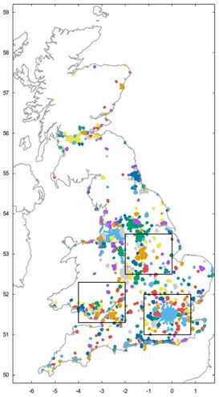
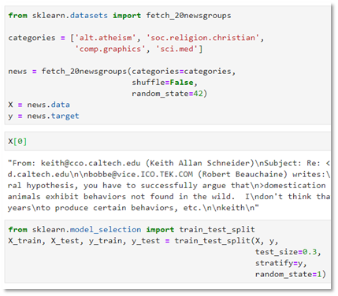

1.  Explain the differences between K-means and DBSCAN clustering
    > algorithms, and discuss the advantages and disadvantages. (10 pts)

| Your Answer |
|-------------|
|             |

2.  Explain what are the ‘one-hot representation’ and ‘vector
    > representation’ of a word. Select one of the existing word
    > embedding algorithms and explain how it works to obtain an
    > appropriate vector representation. (10 pts)

| Your Answer |
|-------------|
|             |

3.  Explain what ‘Vanishing Gradient Problem’ is. Compare the sigmoid
    > function and ReLU function in the context of the vanishing
    > gradient and computation efficiency. (10 pts)

| Your Answer |
|-------------|
|             |

4.  Explain the difference between Sigmoid and Softmax function. For
    > following x, compute both Sigmoid(**x**) and Softmax(**x**) (10
    > pts)

> **x** = \[-0.5, 1.2, -0.1, 2.4\]

| Your Answer |
|-------------|
|             |

5.  The “urbanGB-simple.csv” is the coordinates (longitude and latitude)
    > of 1000 road accidents occurred in urban areas in Great Britain.
    > Perform k-means and DBSCAN clustering on this dataset. For
    > k-means, find proper *k* by using distortion and silhouette
    > analysis. For DBSCAN, find proper *epsilon* and *minPts* so that
    > you can get the similar result to the K-means. Plot the clusters
    > and outliers. (20 pts)

| Code                    |
|-------------------------|
|                         |
| Result(Captured images) |
|                         |
| Description             |
|                         |

6.  20newsgroup dataset is a news dataset consisting of 20 categories.
    > Apply Logistic Regression and Decision Tree Classifier on
    > 20newsgroups dataset to build a document classification model. In
    > this question, we only use samples from 4 categories. (30pts)

> Follow this process:
>
> 1\) Load the data. Use fetch_20newsgroups().
>
> 
>
> 2\) Make preprocessor function & porter stemmer tokenizer function.
>
> 3\) Apply the TF-IDF(TFidfVectorizer) on the data.

\- Use the preprocessor function & porter stemmer tokenizer

> \- Use stop-words
>
> \- Drop terms occurred in more than 10% of docs
>
> \- Drop terms occurred in less than 10 docs
>
> 4\) Train models(Logistic Regression, Decision Tree) using TF-IDF
> vectors.
>
> \- Check the accuracies of the model
>
> \- Find out what are the most important words for this classification
>
> 5\) Predict the categories of following 4 sentences

<table>
<colgroup>
<col style="width: 100%" />
</colgroup>
<thead>
<tr class="header">
<th>
'The outbreak was declared a global pandemic by the World Health Organization (WHO) on 11 March.',

'Today, computer graphics is a core technology in digitalphotography, film, video games, cell phone and computer displays,and many specialized applications.',

'Arguments for atheism range from philosophical to social and historical approaches.',

'The Bible is a compilation of many shorter books written at different times by a variety of authors, and later assembled into the biblical canon.'
</th>
</tr>
</thead>
<tbody>
</tbody>
</table>

| Code                    |
|-------------------------|
|                         |
| Result(Captured images) |
|                         |
| Description             |
|                         |
